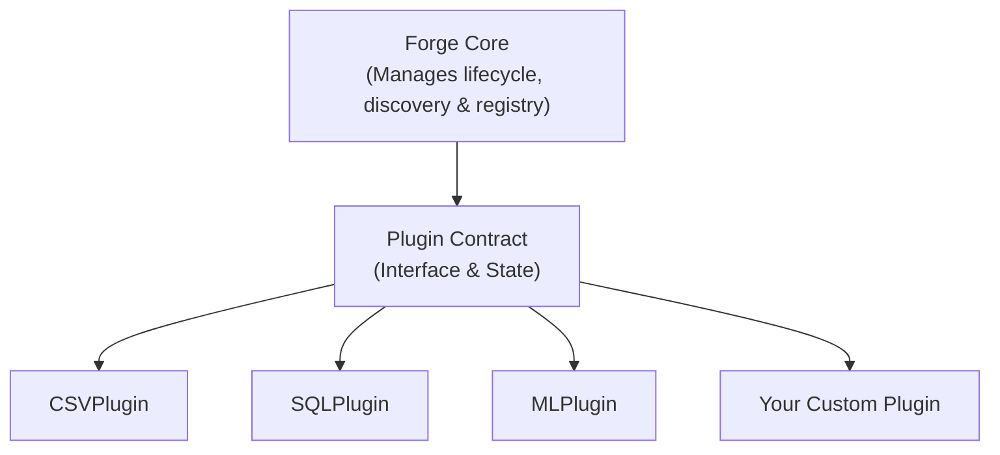
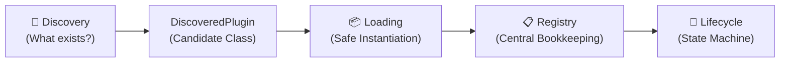

# 🔥 Forge

[](https://www.python.org/downloads/)
[](https://opensource.org/licenses/MIT)
[]()

> **Forge** is a lightweight, extensible Python plugin framework designed to turn independent pieces of functionality into a cohesive, discoverable, and manageable ecosystem.

---

## 🧭 The Core Philosophy

Forge is built on a fundamental architectural principle:

> **The Forge core manages plugins without knowing their implementation details.**

A new plugin can extend the framework without requiring a single line of modification to the Forge core:



---

## ⚡ The Flow of a Plugin

Forge cleanly separates each operational phase so that no single component does too much:



1. **Discovery**: Locates available plugins in directories or Python modules without running them.
2. **Loading**: Safely instantiates candidate classes with error wrapping and failure isolation.
3. **Registry**: Tracks known plugins and prevents name collisions.
4. **Lifecycle**: Coordinates validated state transitions (`DISCOVERED` ➔ `LOADED` ➔ `INITIALIZED` ➔ `ACTIVE` ➔ `STOPPED` / `FAILED`).

---

## 🚀 Quickstart in 60 Seconds

### 1. Define a Plugin

```python
from forge.contracts.plugin import Plugin, PluginMetadata

class GreeterPlugin(Plugin):
    def __init__(self) -> None:
        super().__init__(
            PluginMetadata(
                name="greeter",
                version="1.0.0",
                description="Greets users.",
                author="You",
            )
        )

    def initialize(self) -> None:
        pass

    def execute(self, name: str = "World") -> str:
        return f"Hello, {name} from Forge!"

    def shutdown(self) -> None:
        pass
```

### 2. Discover, Load, and Run

```python
from forge.core.lifecycle import PluginLifecycleManager
from forge.core.loader import PluginLoader
from forge.core.registry import PluginRegistry

# Setup framework services
registry = PluginRegistry()
lifecycle = PluginLifecycleManager()
loader = PluginLoader(lifecycle_manager=lifecycle, registry=registry)

# Load plugin and step through the controlled lifecycle
plugin = loader.load(GreeterPlugin)
lifecycle.initialize(plugin)
lifecycle.activate(plugin)

# Execute
print(plugin.execute("Forge Developer"))
# Output: "Hello, Forge Developer from Forge!"

lifecycle.stop(plugin)
```

---

## 📚 Documentation Suite

Explore our interconnected documentation guides to learn more about the design and architecture:

| Guide | Description |
| :--- | :--- |
| 🚀 **[Getting Started](docs/getting_started.md)** | Step-by-step tutorial for creating, discovering, and executing plugins. |
| 📜 **[Contracts & Lifecycle](docs/contracts_and_lifecycle.md)** | In-depth look at `PluginMetadata`, `PluginState`, and the safe state machine. |
| 📋 **[Registry & Discovery](docs/registry_and_discovery.md)** | How Forge finds plugins across modules/directories and tracks them safely. |
| 📦 **[Dynamic Loading & Failure Isolation](docs/dynamic_loading.md)** | Safe instantiation, registry coordination, and preventing faulty plugins from crashing Forge. |
| 🗺️ **[Master Architecture Blueprint](docs/architecture.md)** | The comprehensive 20-phase master roadmap and design philosophy of Forge. |

---

## 🗺️ Roadmap & Current Progress

Forge is built through disciplined, incremental phases:

- [x] **Phase 0**: Architecture & Guiding Principles ([docs/architecture.md](docs/architecture.md))
- [x] **Phase 1**: Plugin Contract (`Plugin`, `PluginMetadata`, `PluginState`)
- [x] **Phase 2**: Lifecycle State Machine (`PluginLifecycleManager`, `VALID_TRANSITIONS`)
- [x] **Phase 3**: Plugin Registry (`PluginRegistry`, membership & lookups)
- [x] **Phase 4**: Plugin Discovery (`ModulePluginDiscoverer`, `DirectoryPluginDiscoverer`)
- [x] **Phase 5**: Dynamic Loading (`PluginLoader`, failure isolation)
- [ ] **Phase 6**: Validation & Exceptions
- [ ] **Phase 7**: Plugin Context & Dependency Injection
- [ ] **Phase 8**: Event-Driven Communication
- [ ] **Phase 9**: Extension Hooks
- [ ] **Phase 10**: Command System

---

## 🧪 Testing

Run the full automated test suite using `pytest`:

```bash
python -m pytest -v
```

All 32 tests across contracts, lifecycle, registry, discovery, and loader run in under 0.2 seconds.

---

## 📄 License

MIT License. See [LICENSE](LICENSE) for details.
