# 🔥 Forge Architecture

> **Forge** is a lightweight, extensible Python plugin framework designed to turn independent pieces of functionality into a cohesive, discoverable, and manageable ecosystem.

---

## 🧭 Overview

Forge is a lightweight, extensible Python plugin framework designed to allow independently developed plugins to be:

* 🔎 Discovered
* 📦 Loaded
* ✅ Validated
* 🚀 Initialized
* ⚙️ Executed
* 🛑 Shut down

All plugins operate through a **common architecture and contract**.

### 🎯 Primary Design Goal

> **Extensibility.**

The Forge core should provide the infrastructure required to manage plugins **without knowing the implementation details of individual plugins**.

A new plugin should therefore be capable of extending Forge's functionality **without requiring modifications to the Forge core**.

In other words:

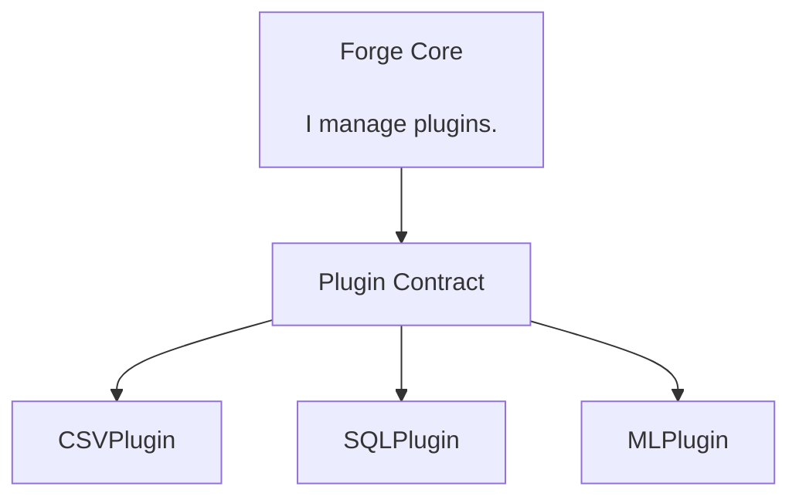

The core provides the **infrastructure**.

Plugins provide the **functionality**.

---

# 🧩 Core Design Principle

Forge follows a **contract-based architecture**.

The framework defines a common `Plugin` contract that all Forge plugins must satisfy.

Conceptually:

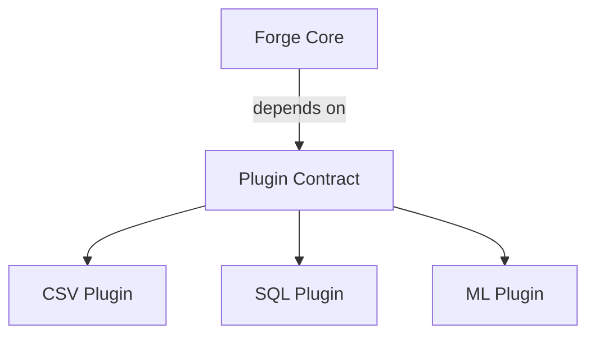

The core interacts with plugins through the **common contract**, rather than depending directly on concrete plugin implementations.

This allows plugins to be:

* ➕ Added
* 🔄 Replaced
* ➖ Removed

without changing the framework's core logic.

### 💡 The architectural idea

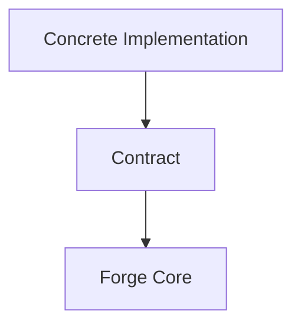

not:

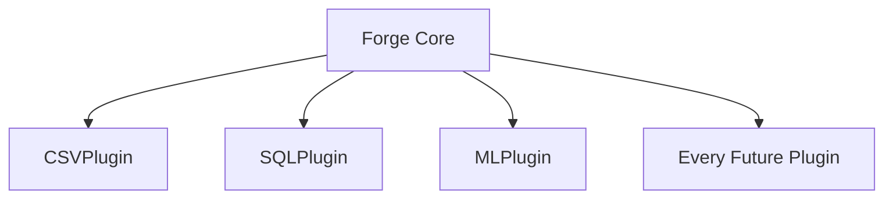

The second approach would turn Forge into a plugin-specific framework, which defeats the purpose of having a plugin architecture in the first place.

---

# 🏗️ Architectural Goals

Forge should provide the following capabilities over its development lifecycle:

| Capability                     | Purpose                                                         |
| ------------------------------ | --------------------------------------------------------------- |
| 🧩 Plugin abstraction          | Define a common plugin contract                                 |
| 🔄 Lifecycle management        | Control plugin states and transitions                           |
| 📋 Plugin registration         | Maintain known plugins                                          |
| 🔎 Plugin discovery            | Find available plugins                                          |
| 📦 Dynamic plugin loading      | Import and instantiate plugins                                  |
| ✅ Plugin validation            | Verify plugin correctness                                       |
| 🔗 Dependency management       | Manage plugin dependencies                                      |
| ⚙️ Configuration               | Provide configurable framework behavior                         |
| 💉 Dependency injection        | Supply framework-managed services                               |
| 📡 Event-driven communication  | Allow decoupled communication                                   |
| 🪝 Extension hooks             | Provide controlled extension points                             |
| ⌨️ Command registration        | Allow plugins to expose commands                                |
| 🖥️ CLI interaction            | Interact with Forge through the command line                    |
| 🛡️ Error isolation & recovery | Prevent individual failures from unnecessarily collapsing Forge |
| 🧪 Testing infrastructure      | Support reliable framework and plugin testing                   |
| 🌍 Third-party plugin support  | Allow independently developed plugins                           |

These capabilities will be introduced **incrementally**, rather than implemented simultaneously.

> ⚠️ **Development principle:**
> Do not build the entire spaceship before the engine has successfully turned over.

---

# 🧱 Architectural Boundaries

Forge is divided into several logical areas.

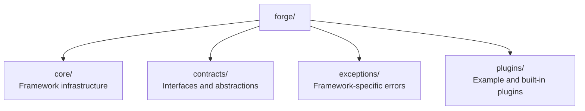

Each area has a distinct responsibility.

The purpose of these boundaries is to prevent unrelated responsibilities from gradually becoming tangled together.

---

# ⚙️ Core

The `core` package contains the machinery responsible for operating Forge.

Potential responsibilities include:

* 🚀 Application startup and shutdown
* 🧩 Plugin management
* 📋 Plugin registration
* 🔎 Plugin discovery
* 📦 Plugin loading
* 🔄 Lifecycle management
* ⚙️ Configuration management
* 📡 Event management
* ⌨️ Command dispatching

### 🚫 Domain-Agnostic Core

The core should remain **domain-agnostic**.

For example, the core should **not** contain logic such as:

```python
if plugin.name == "csv":
    ...
```

or:

```python
if isinstance(plugin, CSVPlugin):
    ...
```

Such logic couples the framework to specific plugins and makes the architecture difficult to extend.

Instead:

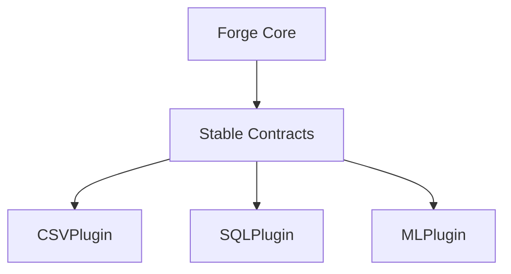

The core should communicate through **stable contracts**.

---

# 📜 Contracts

The `contracts` package defines the interfaces that components must satisfy.

The most important contract is the `Plugin` abstraction.

Conceptually:

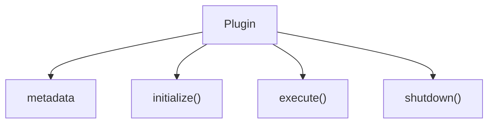

Concrete plugins implement this contract.

For example:

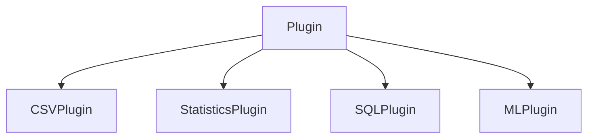

### 🧠 Contract Philosophy

The contract should remain **small and stable**.

A plugin should not need to understand the internal implementation of Forge in order to satisfy the contract.

The plugin needs to know:

> **"What does Forge expect from me?"**

It should not need to know:

> **"How does Forge internally perform its job?"**

---

# 🧩 Plugins

Plugins contain functionality that extends Forge.

Example plugins may eventually include:

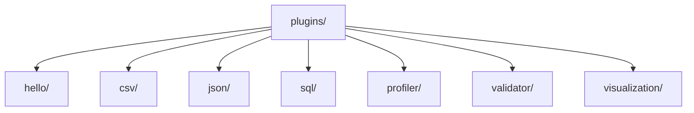

These are **examples rather than mandatory implementations**.

The framework itself should not depend on the existence of any particular plugin.

For example:

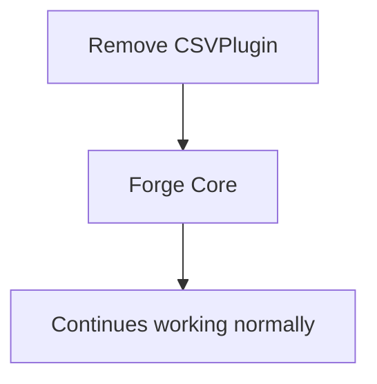

Removing the CSV plugin should therefore **not require modifying the Forge core**.

---

# 🔄 Plugin Lifecycle

Plugins will eventually follow a controlled lifecycle.

The initial conceptual lifecycle is:

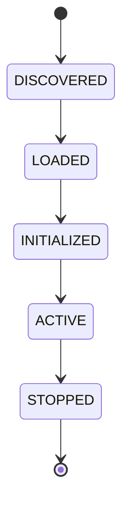

Failure states may occur during different stages:

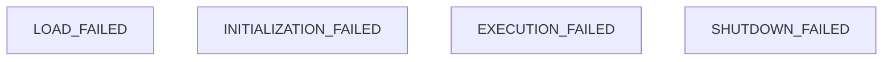

Forge, rather than individual plugins, should ultimately be responsible for coordinating this lifecycle.

This provides:

* Predictable behavior
* Clear state transitions
* Centralized lifecycle control
* Easier plugin failure handling

---

# 📋 Plugin Registry

Forge will maintain a registry of known plugins.

Conceptually:

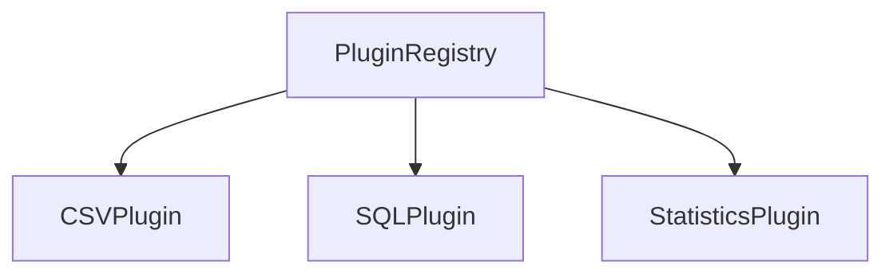

The registry will eventually provide operations such as:

* ➕ Register a plugin
* ➖ Unregister a plugin
* 🔍 Retrieve a plugin
* ❓ Check whether a plugin exists
* 📃 List registered plugins

The registry should not need to know the internal implementation of each plugin.

Its responsibility is to answer questions such as:

> "Which plugins does Forge currently know about?"

not:

> "How does each plugin internally work?"

---

# 🔎 Plugin Discovery & Loading

Plugin discovery and plugin loading are **separate responsibilities**.

Keeping them separate prevents plugin management from turning into one giant component that discovers, imports, validates, constructs, and manages everything at once.

## 🔎 Discovery

Discovery answers:

> **Which plugins are available?**

Potential discovery mechanisms may include:

* 📁 Plugin directories
* 🐍 Python modules
* 📦 Python package entry points

## 📦 Loading

Loading answers:

> **How do we import and instantiate a discovered plugin?**

The conceptual flow is:

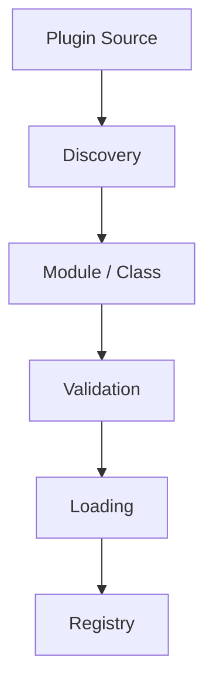

### 🧱 Separation of Concerns

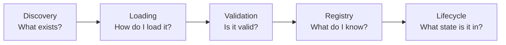

Each responsibility remains conceptually distinct.

---

# 🔗 Dependency Direction

Forge should follow a dependency direction similar to:

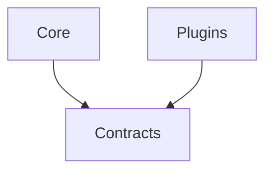

More precisely, the core and plugins should communicate through **abstractions rather than concrete implementations wherever practical**.

The framework should avoid unnecessary dependencies from core components into individual plugins.

### 🎯 Architectural Objective

Keep the central architecture stable while allowing the outer plugin ecosystem to evolve.

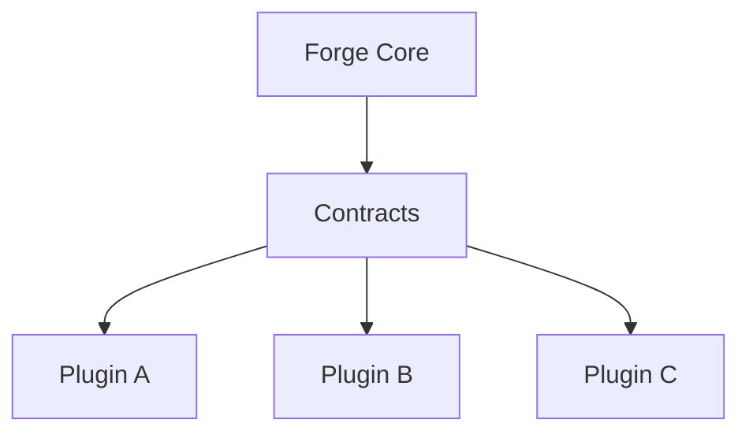

---

# 💉 Dependency Injection

As Forge becomes more sophisticated, plugins may require framework services such as:

* 📝 Logging
* ⚙️ Configuration
* 📡 Event communication
* 💾 Storage
* 🧰 Other framework-managed services

Plugins should not be responsible for constructing these services themselves.

Instead, Forge may provide a `PluginContext`:

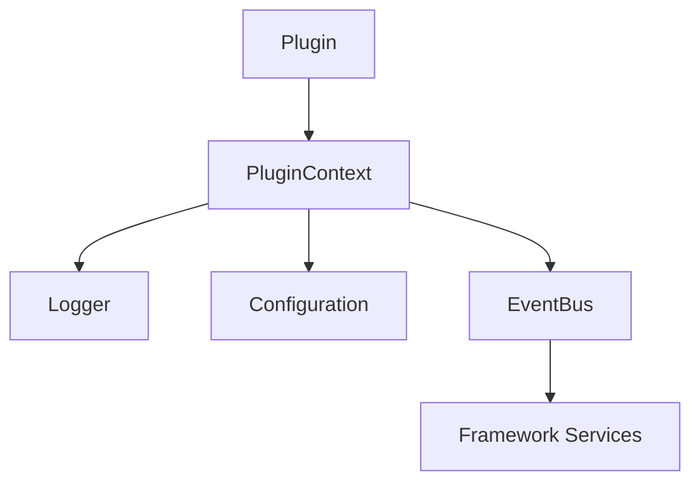

This will allow dependencies to be supplied to plugins while keeping plugin implementations **loosely coupled to the framework**.

---

# 📡 Event-Driven Communication

Forge may eventually provide an event system allowing components and plugins to communicate without directly depending on one another.

Conceptually:

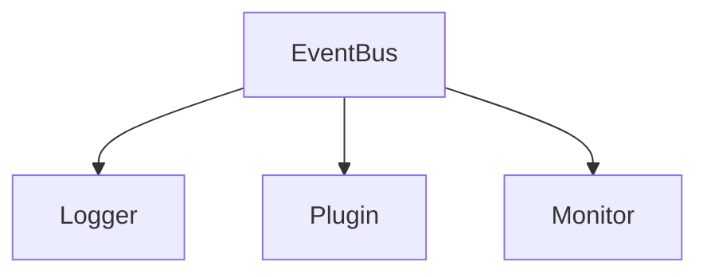

Possible events include:

```text
PLUGIN_DISCOVERED
PLUGIN_LOADED
PLUGIN_INITIALIZED
PLUGIN_STARTED
PLUGIN_STOPPED
PLUGIN_FAILED
```

This architecture will allow additional functionality to react to framework events **without modifying the components that generated those events**.

### Example

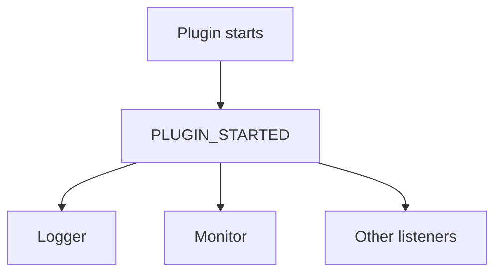

The event producer does not need to know who is listening.

---

# 🪝 Extension Hooks

Events describe **things that happen**.

Hooks provide **controlled extension points around framework operations**.

For example:

```mermaid
flowchart TD
    Before["before_execute"] --> Execute["execute"] --> After["after_execute"]
```

Hooks may eventually be available for operations such as:

* 📦 Plugin loading
* 🚀 Plugin initialization
* ⚙️ Plugin execution
* 🛡️ Error handling
* 🛑 Plugin shutdown

This allows advanced plugins to extend framework behavior **without modifying the framework itself**.

### Events vs Hooks

```mermaid
flowchart LR
    Event["Event<br/>What happened?"]
    Hook["Hook<br/>What can I plug into before or after it happens?"]
```

---

# ⌨️ Command Architecture

Plugins may eventually expose commands that can be executed through Forge.

Conceptually:

```mermaid
flowchart TD
    Plugin["Plugin"] --> Commands["Commands"]
    Commands --> Registry["Command Registry"]
    Registry --> Dispatcher["Dispatcher"]
    Dispatcher --> Execution["Execution"]
```

For example:

```bash
forge plugins list
forge plugins info profiler
forge run profiler dataset.csv
```

The command system should remain independent of the concrete implementation of individual plugins.

---

# 🛡️ Error Handling

Forge should distinguish between **framework failures** and **plugin failures**.

A conceptual exception hierarchy:

```mermaid
flowchart TD
    ForgeError["ForgeError"]
    ForgeError --> PluginError["PluginError"]
    PluginError --> LoadError["PluginLoadError"]
    PluginError --> ValidationError["PluginValidationError"]
    PluginError --> InitializationError["PluginInitializationError"]
    PluginError --> ExecutionError["PluginExecutionError"]
    PluginError --> ShutdownError["PluginShutdownError"]
    ForgeError --> ConfigurationError["ConfigurationError"]
```

### 🚨 Failure Isolation

A faulty plugin should not unnecessarily bring down the entire framework.

```mermaid
flowchart TD
    Forge["Forge"] --> PluginA["Plugin A"]
    Forge --> PluginB["Plugin B"]
    Forge --> PluginC["Plugin C"]
    PluginB --> Failure["Isolated Failure"]
```

Errors should be:

* 📝 Explicit
* 🔍 Traceable
* 📜 Logged
* 👤 Meaningful to users
* 🧪 Testable

---

# 📊 Data Science Extension Layer

Although Forge itself is **domain-agnostic**, the initial demonstration plugins will focus on Data Science.

Potential plugins include:

```mermaid
flowchart TD
    DataScience["Data Science Plugins"]
    DataScience --> CSV["CSV Loader"]
    DataScience --> JSON["JSON Loader"]
    DataScience --> SQL["SQL Connector"]
    DataScience --> Profiler["Data Profiler"]
    DataScience --> Validator["Data Validator"]
    DataScience --> Visualization["Visualization"]
    DataScience --> ML["ML Experiment"]
```

This provides a practical demonstration of the framework while keeping the framework itself reusable for other domains.

For example:

```mermaid
flowchart TD
    Core["Forge Core"] --> Profiler["Data Profiler"]
    Core --> Validator["Data Validator"]
    Core --> SQL["SQL Plugin"]
    SQL --> ML["ML Plugin"]
```

The Data Science functionality belongs to **plugins**, not to the Forge core.

---

# 🌍 Third-Party Plugin Architecture

One of Forge's long-term goals is to support plugins developed independently of the main repository.

Eventually, the ecosystem may look like:

```mermaid
flowchart TD
    Core["Forge Core"] --> CSV["forge-csv"]
    Core --> SQL["forge-sql"]
    Core --> Profiler["forge-profiler"]
    Core --> ML["forge-ml"]
    Core --> ThirdParty["third-party-plugin"]
```

Third-party plugins should interact with Forge through the **public plugin contract and supported APIs**.

This will eventually require consideration of:

* 🐍 Python packaging
* 🔢 Version compatibility
* 🏷️ Plugin metadata
* 🔗 Dependency requirements
* 🔎 Package discovery
* 📦 Entry points

---

# 🧠 Guiding OOP Principles

Forge is intentionally designed to demonstrate **practical object-oriented design**.

The important principles include:

## Abstraction

Expose **what a component can do**, rather than how it does it.

## Encapsulation

Keep internal implementation details inside the component that owns them.

## Polymorphism

Allow different plugin implementations to be used through the same contract.

```mermaid
flowchart TD
    Contract["Plugin Contract"]
    Contract --> CSV["CSV"]
    Contract --> SQL["SQL"]
    Contract --> ML["ML"]
```

Different implementations.

Same interface.

## Composition

Build complex framework components from smaller cooperating objects.

```mermaid
flowchart TD
    Complex["Complex Component"]
    Complex --> A["Component A"]
    Complex --> B["Component B"]
    Complex --> C["Component C"]
```

## Single Responsibility

Each component should have **one clear reason to change**.

## Open/Closed Principle

The framework should be **open to extension** without requiring modification of stable core components.

## Dependency Inversion

High-level framework logic should depend on **abstractions rather than concrete plugin implementations**.

### 🎯 Important

These principles should emerge naturally from the architecture rather than being added artificially.

Forge should demonstrate **why** these principles are useful, not merely contain classes named after them.

---

# 🗺️ Development Strategy

Forge will be developed incrementally.

The development roadmap is:

```mermaid
flowchart TD
    P0["Phase 0<br/>Architecture"] --> P1["Phase 1<br/>Plugin Contract"]
    P1 --> P2["Phase 2<br/>Lifecycle"]
    P2 --> P3["Phase 3<br/>Registry"]
    P3 --> P4["Phase 4<br/>Discovery"]
    P4 --> P5["Phase 5<br/>Dynamic Loading"]
    P5 --> P6["Phase 6<br/>Validation & Exceptions"]
    P6 --> P7["Phase 7<br/>Context & Dependency Injection"]
    P7 --> P8["Phase 8<br/>Events"]
    P8 --> P9["Phase 9<br/>Hooks"]
    P9 --> P10["Phase 10<br/>Commands"]
    P10 --> P11["Phase 11<br/>CLI"]
    P11 --> P12["Phase 12<br/>Configuration"]
    P12 --> P13["Phase 13<br/>Dependency Resolution"]
    P13 --> P14["Phase 14<br/>Enable / Disable"]
    P14 --> P15["Phase 15<br/>Testing"]
    P15 --> P16["Phase 16<br/>Data Science Plugins"]
    P16 --> P17["Phase 17<br/>Third-Party Packaging"]
    P17 --> P18["Phase 18<br/>Failure Handling"]
    P18 --> P19["Phase 19<br/>Performance & Concurrency"]
    P19 --> P20["Phase 20<br/>Production Polish"]
```

### 🧱 Incremental Development Rule

Each phase should produce a **working improvement to Forge**.

We should avoid implementing future abstractions before the current phase requires them.

> **Build what the current phase needs.**
> **Let future architecture emerge when future requirements arrive.**

This keeps the project understandable while preventing premature abstraction.

---

# 🧭 Architectural Principle

The most important rule of the project is:

> ## **Design abstractions around responsibilities, not around objects that happen to exist.**

A class should exist because the system has a **meaningful responsibility that needs to be isolated**, not simply because:

> "This is an OOP project and we need another class."

The objective is **not** to maximize the number of classes.

```text
❌ More classes ≠ Better architecture
```

Instead:

```mermaid
flowchart TD
    Responsibilities["Meaningful Responsibilities"] --> Boundaries["Clear Boundaries"]
    Boundaries --> Contracts["Stable Contracts"]
    Contracts --> Change["Predictable Change"]
```

The objective is to build a system whose design makes **change predictable**.

---

# 🏁 Definition of Success

Forge will be considered successful when a developer can create and install a new plugin that:

* 🧩 Implements the Forge plugin contract
* ⚙️ Provides its own functionality
* 🔎 Is discovered by Forge
* ✅ Is validated and loaded
* 🔄 Participates in the plugin lifecycle
* 💉 Can access supported framework services
* ⌨️ Can expose commands or events where appropriate
* 🚫 Does not require modifications to the Forge core

The ultimate flow should look like:

```mermaid
flowchart TD
    Create["Developer creates plugin"] --> Implement["Implements Plugin Contract"]
    Implement --> Install["Installs it"]
    Install --> Discover["Forge discovers plugin"]
    Discover --> Validate["Validates it"]
    Validate --> Load["Loads it"]
    Load --> Lifecycle["Manages its lifecycle"]
    Lifecycle --> Extend["Plugin extends Forge"]
    Extend --> Stable["Forge Core remains unchanged"]
```

> ## 🔥 The real success criterion

Forge should demonstrate **genuine extensibility**, rather than merely simulate it.

A developer should be able to extend the framework from the outside while the core remains stable.

That is the architecture we are building.
