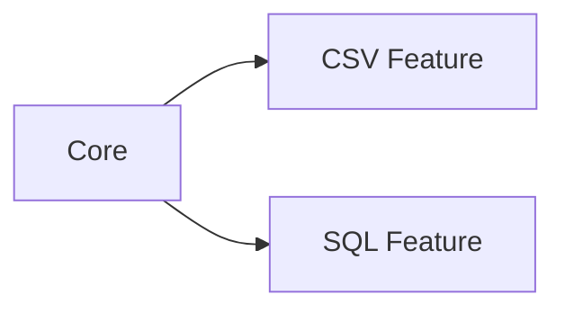
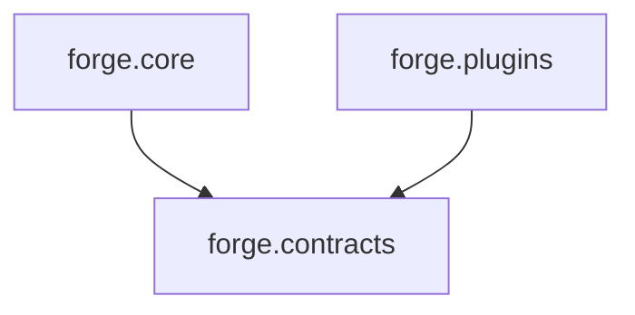
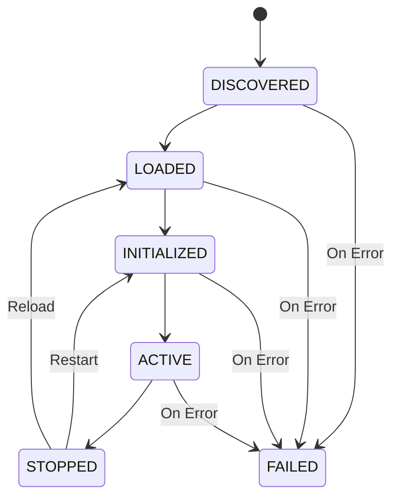

# 📜 Contracts & Lifecycle Management

> **"A contract tells a plugin what Forge expects from it, without revealing how Forge works internally."**

This document explains the design decisions behind Forge's **Contracts** (`forge.contracts`) and **Lifecycle State Machine** (`forge.core.lifecycle`).

---

## 🎯 Architectural Motivation: Dependency Inversion

In typical monolithic applications, core modules import concrete features directly:



In Forge, dependencies point **inward** toward stable abstractions:



### The Golden Boundary Rule
The `contracts` layer **never imports from `core`**. External plugin authors should be able to write plugins using only the `contracts` package without pulling in internal framework machinery.

---

## 🧩 The Plugin Contract

Located in `forge.contracts.plugin`, the contract consists of three key primitives:

### 1. `PluginState`
An enum defining the standardized lifecycle vocabulary:
* `DISCOVERED`: The plugin class has been found but not yet loaded.
* `LOADED`: The plugin has been instantiated and registered.
* `INITIALIZED`: Heavy resources (databases, configs) have been prepared.
* `ACTIVE`: The plugin is ready to accept commands or handle executions.
* `STOPPED`: Resources have been cleaned up.
* `FAILED`: An unhandled error occurred during a state transition.

### 2. `PluginMetadata` (Immutable)
```python
@dataclass(frozen=True)
class PluginMetadata:
    name: str
    version: str
    description: str
    author: str
```
**Why frozen?** Plugin metadata serves as the unique identifier and governance token for each plugin. Freezing it prevents accidental runtime mutation from corrupting registry lookups or logging traces.

### 3. `Plugin` (Abstract Base Class)
Requires three lifecycle methods:
* `initialize() -> None`: Resource allocation.
* `execute() -> Any`: Execution payload.
* `shutdown() -> None`: Resource teardown.

---

## 🔄 The Lifecycle State Machine

Plugins do not transition states on their own; transitions are orchestrated and verified by [PluginLifecycleManager](../src/forge/core/lifecycle.py).



### Transition Verification
The manager validates every transition against `VALID_TRANSITIONS`. Attempting an illegal jump (e.g. going straight from `DISCOVERED` to `ACTIVE`) raises [InvalidStateTransitionError](../src/forge/exceptions/plugin.py).

### Action-First Safety (Bug Prevention)
Notice how `initialize()` is executed:
```python
def initialize(self, plugin: Plugin) -> None:
    try:
        plugin.initialize()                         # 1. Run actual code first
        self._transition(plugin, PluginState.INITIALIZED)  # 2. Confirm state only on success
    except Exception:
        self._transition(plugin, PluginState.FAILED)       # 3. Transition to FAILED on crash
        raise
```
If a plugin crashes during `initialize()`, it is **never** left marked as `INITIALIZED`. It is safely tagged as `FAILED` and the error is bubbled up for isolation.

---

## 🔗 Next Chapter
Now that plugins have contracts and lifecycle rules, how does the framework keep track of them and discover them from the filesystem?

👉 Continue to **[Registry & Discovery Guide](./registry_and_discovery.md)**.
