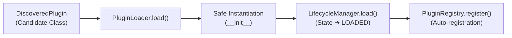

# 📦 Dynamic Loading & Failure Isolation

> **"A single faulty plugin should never collapse the entire framework."**

This document covers Forge's **Dynamic Loading** machinery (`forge.core.loader`) and the core principle of **Failure Isolation**.

---

## 🎯 What Loading Does

Discovery gives us candidates (`DiscoveredPlugin`), but candidate classes are not yet running code.

The [PluginLoader](../src/forge/core/loader.py) bridges the gap between **Discovery** and the **Registry**:



---

## 🚀 Basic Loading

The loader accepts either a `DiscoveredPlugin` candidate or a direct `Plugin` subclass:

```python
from forge.core.loader import PluginLoader
from forge.core.registry import PluginRegistry
from forge.plugins.hello import HelloPlugin

registry = PluginRegistry()
loader = PluginLoader(registry=registry)

# Instantiates HelloPlugin, sets state to LOADED, and registers it
plugin = loader.load(HelloPlugin)

assert plugin.state.name == "LOADED"
assert "hello" in registry
```

If instantiation fails (for example, missing `__init__` arguments or a crash inside constructor code), the error is intercepted and raised as a typed [PluginLoadError](../src/forge/exceptions/plugin.py).

---

## 🛡️ Failure Isolation

A key architectural requirement from [docs/architecture.md](./architecture.md) is:

> *"A faulty plugin should not unnecessarily bring down the entire framework."*

Imagine a scenario where an application discovers 10 third-party plugins in a folder, but one of them has a bug in its `__init__` method. In a fragile framework, the whole application crashes during startup.

In Forge, `load_all` provides the `fail_fast` option:

```python
from forge.core.discovery import DirectoryPluginDiscoverer
from forge.core.loader import PluginLoader
from forge.core.registry import PluginRegistry

registry = PluginRegistry()
loader = PluginLoader(registry=registry)

candidates = DirectoryPluginDiscoverer("./plugins").discover()

# Load all plugins with failure isolation enabled
loaded_plugins = loader.load_all(candidates, fail_fast=False)

print(f"Successfully loaded {len(loaded_plugins)} plugins.")
```

### How `fail_fast=False` Works
* Each plugin is instantiated and loaded inside an isolated boundary.
* If a plugin crashes, the error is suppressed/logged, the faulty plugin is skipped, and remaining healthy plugins continue loading without disruption.
* When strict validation is required (such as in CI or debug mode), `fail_fast=True` will immediately stop and raise the `PluginLoadError`.

---

## 🧭 The End-to-End Journey

Connecting all the components together:

```python
from forge.core.discovery import ModulePluginDiscoverer
from forge.core.lifecycle import PluginLifecycleManager
from forge.core.loader import PluginLoader
from forge.core.registry import PluginRegistry

# 1. Setup core services
registry = PluginRegistry()
lifecycle = PluginLifecycleManager()
loader = PluginLoader(lifecycle_manager=lifecycle, registry=registry)

# 2. Discover available plugins
candidates = ModulePluginDiscoverer("forge.plugins").discover()

# 3. Safely load plugins into the registry
plugins = loader.load_all(candidates)

# 4. Initialize and run an active plugin
for plugin in plugins:
    lifecycle.initialize(plugin)
    lifecycle.activate(plugin)
    output = plugin.execute()
    print(f"[{plugin.metadata.name}] output: {output}")
    lifecycle.stop(plugin)
```

---

## 🔗 Related Documentation
* **[Getting Started](./getting_started.md)**: Tutorial for creating plugins.
* **[Contracts & Lifecycle](./contracts_and_lifecycle.md)**: Details on the underlying state machine.
* **[Registry & Discovery](./registry_and_discovery.md)**: How plugins are found and tracked.
* **[Master Architecture Blueprint](./architecture.md)**: Complete 20-phase roadmap.
