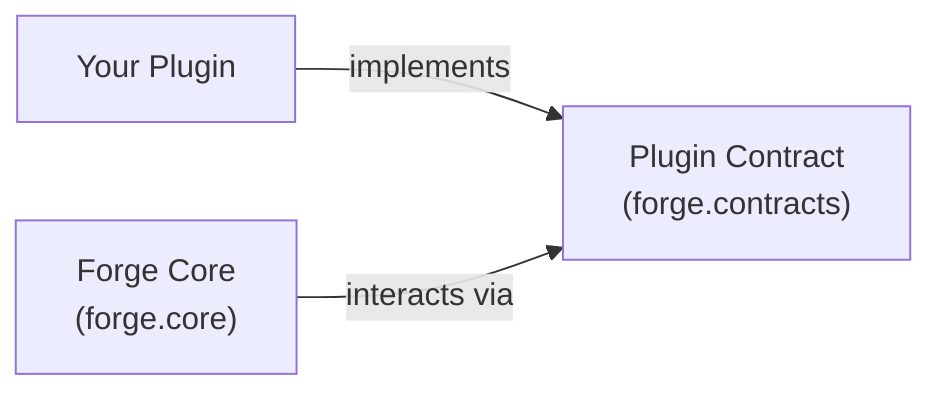

# 🚀 Getting Started with Forge

Welcome to **Forge**! This guide walks you through setting up Forge, understanding its core concepts, and building your first custom plugin from scratch.

---

## 🧭 The Forge Story in 60 Seconds

Forge is built on a simple yet powerful rule: **the framework core should never know the internal details of the plugins it manages.**



Instead of tightly coupling features together, Forge provides the lifecycle, discovery, and registry infrastructure so your code stays modular and extensible.

---

## 🛠️ Installation & Setup

Clone the repository and install test dependencies:

```bash
git clone https://github.com/Mr-Rup/Forge.git
cd Forge

# Verify installation by running unit tests
python -m pytest -v
```

Forge requires **Python 3.10+** and has zero mandatory runtime dependencies.

---

## ✍️ Step 1: Creating Your First Plugin

Every plugin implements the [Plugin](./contracts_and_lifecycle.md) abstract base class and provides immutable metadata:

```python
# my_plugin.py
from forge.contracts.plugin import Plugin, PluginMetadata

class GreeterPlugin(Plugin):
    """A simple plugin that prints personalized greetings."""

    def __init__(self) -> None:
        metadata = PluginMetadata(
            name="greeter",
            version="1.0.0",
            description="Greets users with custom greetings.",
            author="Your Name",
        )
        super().__init__(metadata)

    def initialize(self) -> None:
        """Called by the framework when preparing the plugin."""
        print("Greeter initialized!")

    def execute(self, user_name: str = "World") -> str:
        """The core functionality of your plugin."""
        return f"Hello, {user_name}! Welcome to Forge."

    def shutdown(self) -> None:
        """Called by the framework to clean up resources."""
        print("Greeter stopped cleanly.")
```

---

## 🔄 Step 2: Running the Plugin Through the Framework

Rather than manually invoking plugin methods, Forge coordinates the plugin lifecycle:

```python
from forge.core.lifecycle import PluginLifecycleManager
from forge.core.registry import PluginRegistry

# 1. Initialize core machinery
registry = PluginRegistry()
manager = PluginLifecycleManager()

# 2. Instantiate and register
plugin = GreeterPlugin()
registry.register(plugin)

# 3. Step through the controlled lifecycle
manager.load(plugin)          # State: LOADED
manager.initialize(plugin)    # State: INITIALIZED (runs plugin.initialize())
manager.activate(plugin)      # State: ACTIVE

# 4. Execute the plugin
result = plugin.execute("Alice")
print(result)  # "Hello, Alice! Welcome to Forge."

# 5. Stop the plugin
manager.stop(plugin)          # State: STOPPED (runs plugin.shutdown())
```

---

## 🔎 Step 3: Discovering and Loading Plugins Dynamically

What if you have plugins in a folder or external module and don't want to import them manually? Forge's **Discovery** and **Dynamic Loading** handle this automatically:

```python
from forge.core.discovery import DirectoryPluginDiscoverer
from forge.core.loader import PluginLoader
from forge.core.registry import PluginRegistry

registry = PluginRegistry()
loader = PluginLoader(registry=registry)

# Discover all plugins in a directory
discoverer = DirectoryPluginDiscoverer("./plugins")
candidates = discoverer.discover()

# Load all discovered plugins into the registry safely
loaded_plugins = loader.load_all(candidates, fail_fast=False)

print(f"Loaded {len(loaded_plugins)} plugins: {registry.list_names()}")
```

---

## 📚 Where to Go Next?

Continue exploring Forge's architecture through our interconnected technical guides:

1. **[Contracts & Lifecycle Guide](./contracts_and_lifecycle.md)**: Dive deep into `PluginMetadata`, `PluginState`, and the safe transition state machine.
2. **[Registry & Discovery Guide](./registry_and_discovery.md)**: Learn how Forge answers *"What plugins exist?"* and keeps track of them.
3. **[Dynamic Loading Guide](./dynamic_loading.md)**: Explore safe instantiation, error interception, and failure isolation.
4. **[Master Architecture Blueprint](./architecture.md)**: Read the 20-phase master roadmap for Forge.
