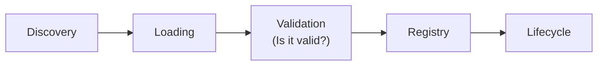
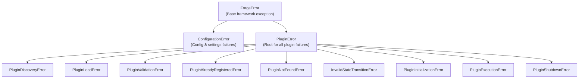

# ✅ Validation & Error Architecture

> **"Explicit, testable errors and strict validation ensure that ill-formed plugins are caught before they touch runtime systems."**

This document covers Forge's **Plugin Validation Engine** (`forge.core.validator`) and the complete **Exception Hierarchy** (`forge.exceptions`).

---

## 🎯 Architectural Motivation: Fail Early, Fail Clearly

Plugins are often written by third parties or loaded dynamically at runtime. If a plugin has a corrupted name, an invalid version, or missing lifecycle hooks, executing it leads to confusing runtime bugs.

In Forge:


The [PluginValidator](../src/forge/core/validator.py) checks every candidate immediately after instantiation before it can transition to `LOADED` or enter the `PluginRegistry`.

---

## 🧩 Validation Rules

### 1. Metadata Verification
* **Plugin Name**: Must be non-empty and slug-formatted (`^[a-zA-Z0-9_-]+$`). Spaces and punctuation are rejected to guarantee safe command-line dispatches and registry dictionary keys.
* **Semantic Versioning**: Must adhere to standard semver formats (e.g. `1.0`, `1.0.0`, `2.1.0-beta`).
* **Author & Description**: Must be non-empty strings.

### 2. Contract Compliance
* Must be an instance of the abstract base class [Plugin](../src/forge/contracts/plugin.py).
* Must provide callable implementations for `initialize()`, `execute()`, and `shutdown()`.

---

## 🔍 Using the Validator

### Inspecting Without Exceptions (`check`)
Dev tools, CLI validators, and linters can inspect plugins and aggregate all issues without crashing:

```python
from forge.core.validator import PluginValidator
from forge.plugins.hello import HelloPlugin

validator = PluginValidator()
result = validator.check(HelloPlugin())

if result.is_valid:
    print("Plugin is valid!")
else:
    for error in result.errors:
        print(f"Validation issue: {error}")
```

### Strict Enforcement (`validate`)
Raises [PluginValidationError](../src/forge/exceptions/plugin.py) with all detected error messages:

```python
validator.validate(plugin)  # Raises PluginValidationError if invalid
```

---

## 🛡️ The Complete Exception Hierarchy

Forge maintains a clear distinction between **framework errors**, **plugin lifecycle errors**, and **configuration errors**:



### Lifecycle Exception Trapping
When a plugin crashes inside its `initialize()` or `shutdown()` method, [PluginLifecycleManager](../src/forge/core/lifecycle.py) traps the exception, marks the plugin state as `FAILED`, and raises typed errors:

* `plugin.initialize()` crash ➔ raises [PluginInitializationError](../src/forge/exceptions/plugin.py)
* `plugin.shutdown()` crash ➔ raises [PluginShutdownError](../src/forge/exceptions/plugin.py)

---

## 🔗 Related Guides
* **[Getting Started](./getting_started.md)**: Tutorial for creating and running plugins.
* **[Contracts & Lifecycle](./contracts_and_lifecycle.md)**: State machine transitions and rules.
* **[Registry & Discovery](./registry_and_discovery.md)**: Locating and tracking plugins.
* **[Dynamic Loading](./dynamic_loading.md)**: Safe instantiation and failure isolation.
